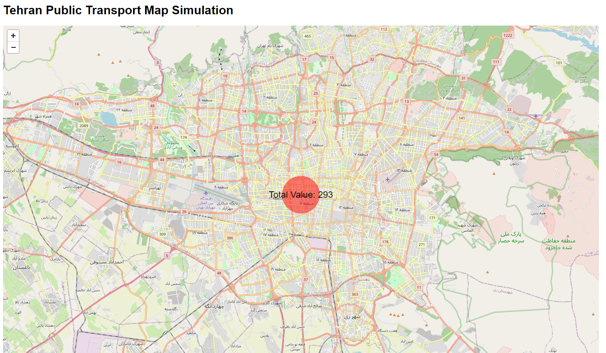
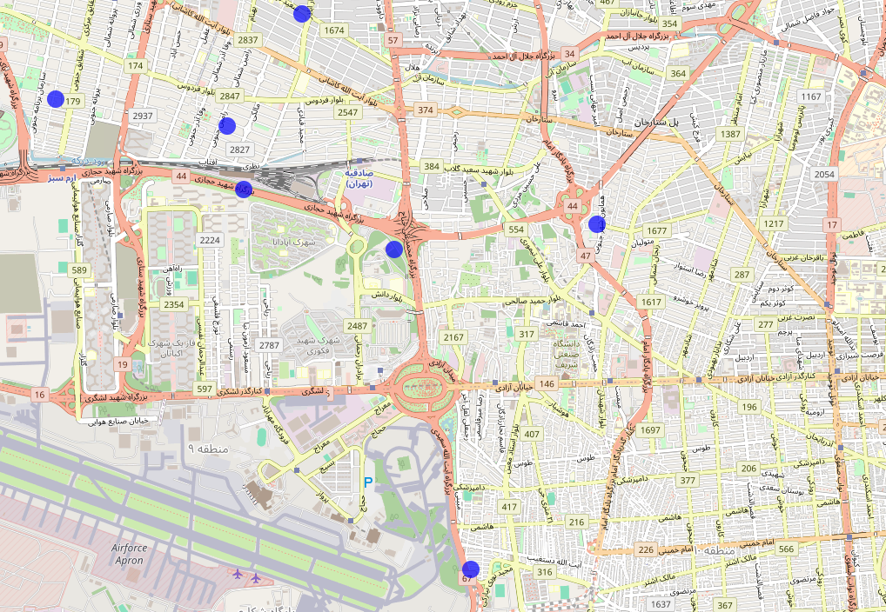

# Tehran Map with Point Merging

An interactive map of Tehran built with D3.js and Leaflet.js that features point merging, data aggregation, and distance calculation for public transportation visualization.





## Features

- **Interactive Zooming**: Zoom in and out to explore the map and view points.
- **Point Merging**: Points aggregate into a single value when zoomed out, showing total data at a glance.
- **Distance Calculation**: Automatically calculates and logs the distance between points on the map.
- **Tooltip Display**: Hover over points to see detailed information.

## Installation

1. Clone the repository:
   ```bash
   git clone https://github.com/yourusername/tehran-map.git
   cd tehran-map
